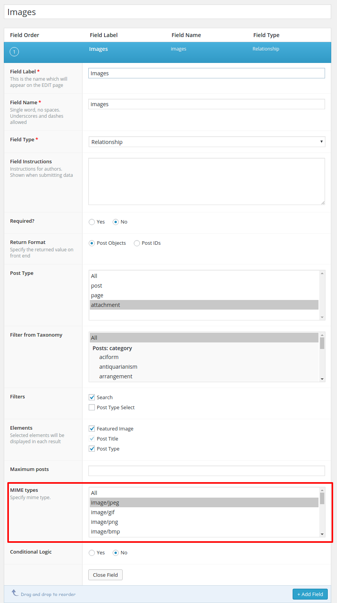
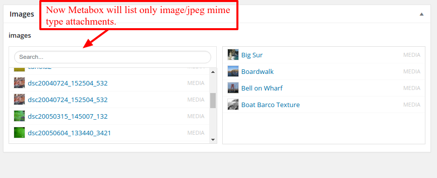

<!-- DO NOT EDIT THIS FILE; it is auto-generated from readme.txt -->
# ACF - Relationship MIME type filter

This plugin is an add-on for Advanced Custom Fields. It allows you to use "post_mime_type" filter in "relationship" field.

**Contributors:** [rahulsprjapati](https://profiles.wordpress.org/rahulsprjapati)  
**Tags:** [advanced custom fields](https://wordpress.org/plugins/tags/advanced custom fields), [admin](https://wordpress.org/plugins/tags/admin), [advanced](https://wordpress.org/plugins/tags/advanced), [custom](https://wordpress.org/plugins/tags/custom), [custom field](https://wordpress.org/plugins/tags/custom field), [edit](https://wordpress.org/plugins/tags/edit), [mime filter](https://wordpress.org/plugins/tags/mime filter), [relationship](https://wordpress.org/plugins/tags/relationship), [image](https://wordpress.org/plugins/tags/image), [post type](https://wordpress.org/plugins/tags/post type), [attachment](https://wordpress.org/plugins/tags/attachment), [acf](https://wordpress.org/plugins/tags/acf)  
**Requires at least:** WordPress 3.5.0  
**Tested up to:** WordPress 4.5.3  
**Stable tag:** 1.0.0  
**License:** [GPLv2 or later](http://www.gnu.org/licenses/gpl-2.0.html)  
**Donate link:** https://profiles.wordpress.org/rahulsprajapati/profile/  

 

## Description ##

This plugin is an add-on for Advanced Custom Fields. It allows you to use "post_mime_type" filter in "relationship" field.
### Rate this plugin ###
If this plugin helps you, please give it a good rating. If you have any problems, please ask me. I'm happy to help.

## Installation ##

1. Download Plugin.
   [Download](https://downloads.wordpress.org/plugin/acf-relationship-mime-filter.1.0.0.zip "Download")

2. Install "acf-relationship-mime-filter" plugin from the 'Plugins' section in your dashboard (Plugins > Add New > Upload Plugin -> Select Plugin Zip File From Downloaded Location).

3. Alternatively you can Unzip it and upload it to the plugins folder of your WordPress installation (wp-content/plugins/ directory of your WordPress installation).

4. Activate it through the 'Plugins' section.

5. Now Here we go. Installation is Complete.

## How To Use ##

1. After you Install & Activate plugin you will see "MIME Type" filter option in acf relationship field.

2. Here you will see all mime types of attachment post type.

3. You can select multiple mime types to filter post list in relation ship metabox.

## Screenshots ##

### After activating this add-on you can see mime type filter in relationship field of acf.

### You will see list of attachment which has mime types( i.e image/jpeg ) from specified in acf filter.

## Changelog ##

### 1.0 ###
* Added "post_mime_type" filter in "relationship" field.

